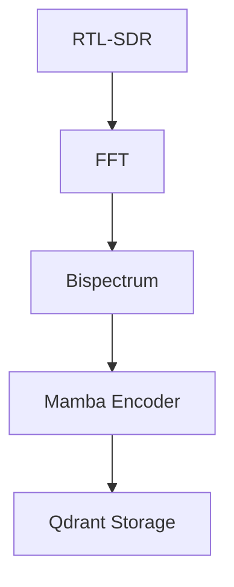

# Markdown Style Guide

## Purpose
Define Markdown documentation standards for Project Twister, ensuring clarity, consistency, and ease of maintenance across technical documentation.

## Core Principles
1. **Technical Accuracy**: All code examples must compile and run
2. **Scannable Structure**: Use headers, lists, and tables for quick reference
3. **Link Hygiene**: All internal links must resolve; external links must have context
4. **Version Awareness**: Document version-specific behavior (Rust, Slint, Burn)

## Document Structure

### Header Hierarchy
```markdown
# H1: Document Title (one per file)

## H2: Major Sections

### H3: Subsections

#### H4: Minor Topics (use sparingly)
```

### Front Matter (for docs/)
```markdown
---
title: "Technology Stack"
description: "Core technologies and versions for Project Twister"
version: "0.5.0"
last_updated: "2025-01-15"
---
```

## Code Blocks

### Rust Examples
````markdown
```rust
// ✅ GOOD: Annotated with context
use burn::backend::wgpu::WgpuDevice;

// Explicit device selection for AMD SAM
let device = WgpuDevice::DiscreteGpu(0); // RX 6700 XT
```

```rust
// ❌ BAD: No context or comments
let device = WgpuDevice::DiscreteGpu(0);
```
````

### Slint Examples
````markdown
```slint
// ✅ GOOD: Complete component with properties
component GlassPanel inherits Rectangle {
    background: rgba(255, 255, 255, 0.65);
    border-radius: 12px;
    drop-shadow-blur: 16px;
}
```
````

### Shell Commands
````markdown
```bash
# ✅ GOOD: Commented with expected output
$ cargo build --release
   Compiling twister v0.5.0
   Finished release [optimized] target(s) in 45s
```
````

## Tables

### Specification Tables
```markdown
| Component | Target Latency | VRAM Usage | Priority |
|-----------|---------------|------------|----------|
| FFT (2048 bins) | ≤0.5ms | 8 MB | P0 |
| Bispectrum | ≤2ms | 64 MB | P1 |
| Mamba Encoder | ≤1ms | 16 MB | P1 |
| Waterfall | ≤1ms | 4 MB | P2 |
```

### Comparison Tables
```markdown
| Framework | Precision | Inference Time | VRAM | Best For |
|-----------|-----------|----------------|------|----------|
| Burn F16 | Half | 0.5ms | 16 MB | Training |
| Candle F16 | Half | 0.3ms | 8 MB | Inference |
| Candle I8 | Int8 | 0.2ms | 4 MB | Edge |
```

## Lists

### Ordered Lists (Sequential Steps)
```markdown
1. Initialize WGPU backend
2. Load model weights into VRAM
3. Create compute pipeline
4. Dispatch kernel with cube count
```

### Unordered Lists (Non-Sequential)
```markdown
- AMD Ryzen 7 5700X (CPU)
- AMD RX 6700 XT (GPU)
- 64GB DDR4 RAM (SAM enabled)
```

### Nested Lists
```markdown
- DSP Pipeline
  - FFT (2048 bins)
  - Bispectrum analysis
  - PDM→PCM conversion
- ML Pipeline
  - Spectrum encoder
  - Modulation classifier
```

## Links

### Internal Links
```markdown
// ✅ GOOD: Relative path with context
See [Burn Style Guide](code_styleguides/burn.md) for tensor definitions.

// ❌ BAD: Absolute path (breaks on clone)
See [Burn Style Guide](C:/Users/pixel/Downloads/twister/...)
```

### External Links
```markdown
// ✅ GOOD: With context and access date
[AMD Smart Access Memory](https://www.amd.com/en/technologies/smart-access-memory)
(accessed 2025-01-15) - Required for unified memory access.

// ❌ BAD: Naked URL
https://www.amd.com/en/technologies/smart-access-memory
```

## Images and Diagrams

### Mermaid Diagrams
```markdown

```

### Image Embeds
```markdown
// ✅ GOOD: With alt text and context

*Figure 1: 128×64 waterfall visualization with bilinear scaling.*

// ❌ BAD: No alt text

```

## Terminology

### Acronyms (First Use)
```markdown
// ✅ GOOD: Define on first use
Smart Access Memory (SAM) enables unified CPU/GPU memory access.
Subsequent uses: SAM

// ❌ BAD: Undefined acronyms
SAM enables unified memory access.
```

### Technical Terms
```markdown
// ✅ GOOD: Consistent capitalization
- RTL-SDR (not rtl-sdr, RTLSDR)
- WGPU (not wgpu, Wgpu)
- Neo4j (not neo4j, NEO4J)
- Qdrant (not qdrant, QDRANT)
```

## Version Annotations

### Rust Version Requirements
```markdown
// ✅ GOOD: Explicit version
Requires Rust 1.75+ (for `async fn` in traits).

// ❌ BAD: Implicit version
Requires Rust.
```

### Slint Version Requirements
```markdown
// ✅ GOOD: With feature flag note
Requires Slint 1.16+ (for `Path` component).

Enable with: `slint = { version = "1.16", features = ["path"] }`
```

## Documentation Comments

### Module-Level Docs
```markdown
// ✅ GOOD: Comprehensive module documentation
## DSP Module

Real-time digital signal processing for RF analysis (10 KHz - 300 MHz).

### Components
- **FFT**: 2048-bin, Hann window, 0.5ms latency
- **PDM**: 64× oversampling, 1ms latency
- **Bispectrum**: Sparse coherence, 2ms latency

### Performance Budget
Total pipeline: ≤5ms per frame
```

### Function Docs
```markdown
## `encode_spectrum(&self, spectrum: &[f32]) -> Result<Vec<f32>>`

Encode 256-bin spectrum into 32-dim latent vector.

### Arguments
- `spectrum`: Log-mapped FFT magnitudes [0.0, 1.0]

### Returns
- `Ok(Vec<f32>)`: L2-normalized latent vector
- `Err(ModelError)`: If inference fails

### Performance
- Target: ≤1ms (RX 6700 XT)
- VRAM: 16 MB
```

## References
- [Markdown Guide](https://www.markdownguide.org/)
- [GitHub Flavored Markdown](https://github.github.com/gfm/)
- [Mermaid Documentation](https://mermaid.js.org/)
